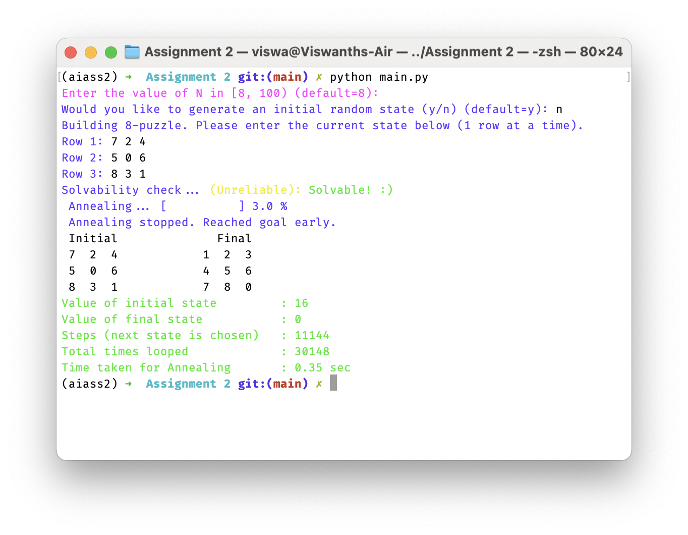
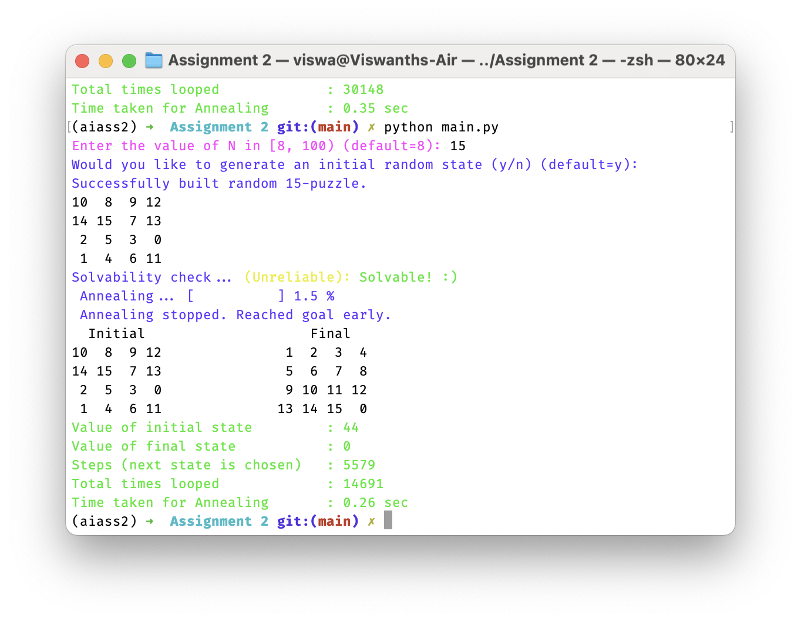
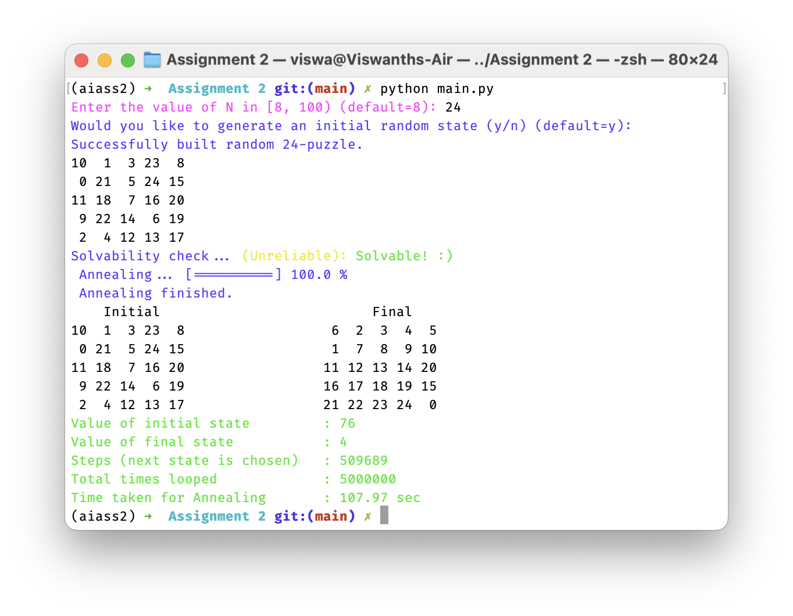
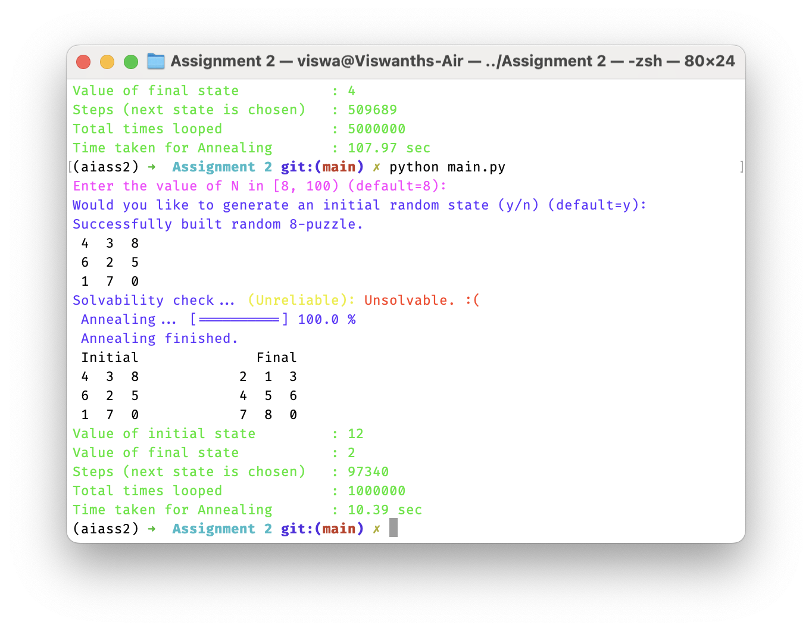
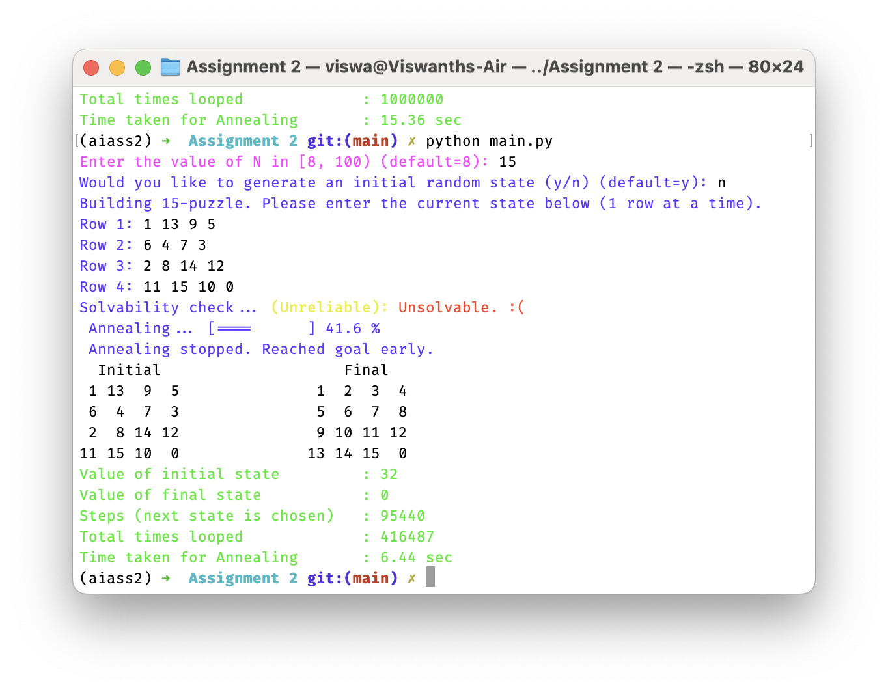
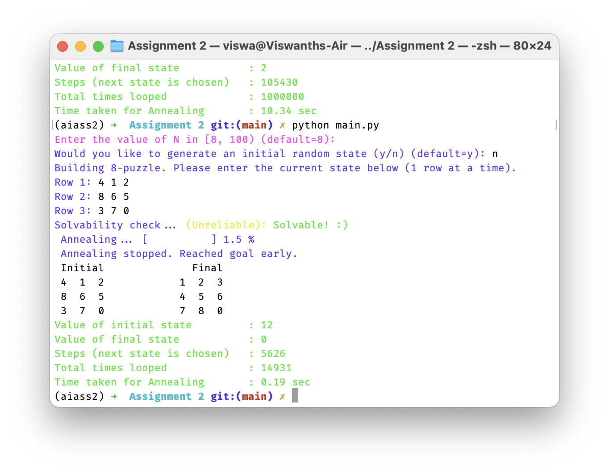
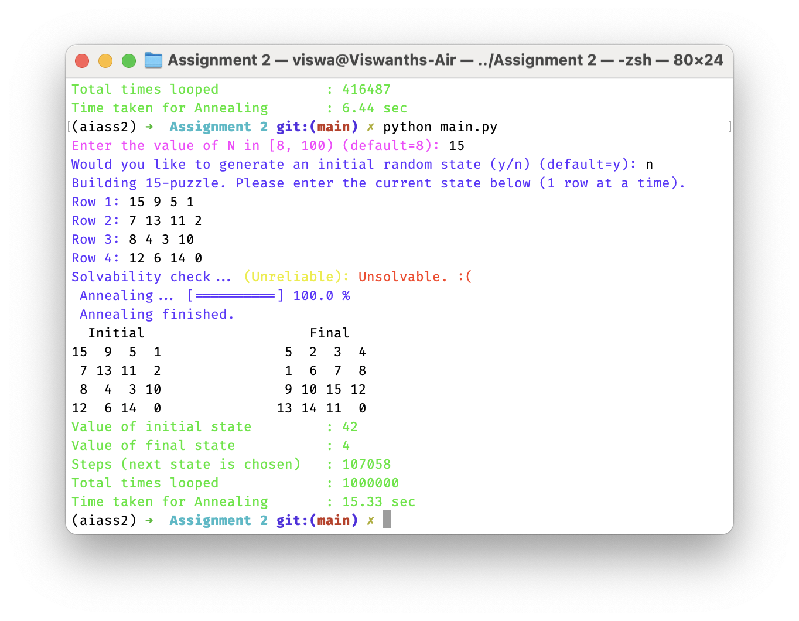

# Simulated Annealing for N-puzzle.

### Preparing to run
This folder consists of three python files. 
- `main.py` - This starts and performs the annealing.
- `puzzle_handler.py` - This file contains a `Puzzle_handler` class that provides puzzle specific functions.
- `util.py` - This has colors for the terminal text and answers for prompts (Fun stuff).

All of them are required for a successful run.

> **_NOTE:_** This program contains colored text which may not appear correctly on older terminal applications.

> **_On Windows:_** It is recommended to use newer version of terminal which can be obtained from [here](https://apps.microsoft.com/detail/9n0dx20hk701?hl=en-US&gl=US) if not already installed.

For cython version, `cython` package needs to be installed which can be done with the following command.
```sh
pip install cython
```

### Run
Almost all the edge cases are considered. You should not be able to give a wrong input puzzle. 

Just execute the following command.
```sh
python main.py
```

To execute the cython version, run the following two commands.
```sh
python setup.py build_ext --inplace
python main_cython.py
```

And follow the instructions.


### Solvability
There is puzzle solvability check that has been implemented. It counts the number of inversions present in a puzzle state, and returns true or false when certain conditions are met.

It is mostly accurate for $N = 8$ but overall not a reliable check for larger puzzles.

## Simulated Annealing

The scheduling function is defined as follows:
$$T = 1 - \frac{t+1}{t_{max}}$$
where $t_{max}$ represents the max number of iterations that occur before the annealing exits. $t$ counts the number of iterations and starts from 0.
So as more iterations occur, $t$ increases and $\frac{t+1}{t_{max}}$ reaches 1 when $t = t_{max} - 1$, and $T$ becomes 0, which is when annealing exits.


> **_NOTE:_** Annealing also exits early if a solution is found before $T$ reaches 0.

For acceptable $N$ values, 

when $N < 24$, $t_{max} = 1000000$, and 

when $N \ge 24$, $t_{max} = \sqrt{N+1} \times 1000000$. 

So expect longer running times from $N \ge 24$.

## Screenshots

Example runs.





In the example below, solvability check says `Unsolvable` but it was solved anyway, hence the unreliable note.

More example runs.




> Some of the test puzzles are taken from this [Sliding Toys](https://sliding.toys/) website.
